# Lane Detection

## Objective

#### This is the basic method for lane detection based on OpenCV.

---

## Dependencies & Enviroment

* Python 3.6, OpenCV 4.2
* OS: Ubuntu 16.04

---

## Full processes for lane detection

1. Read image.

2. Convert original image to grayscale.
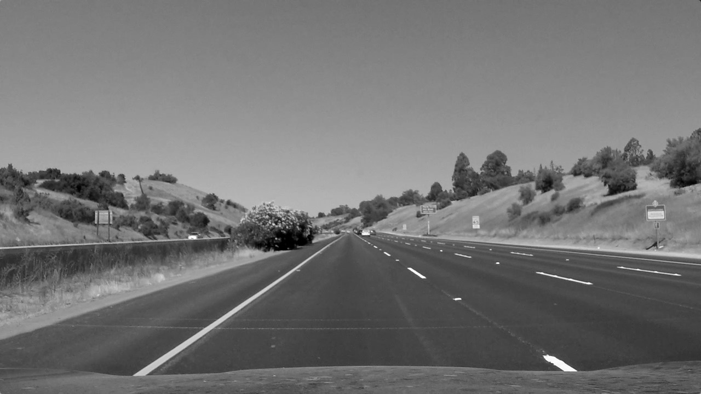

3. Darken the grayscale image.
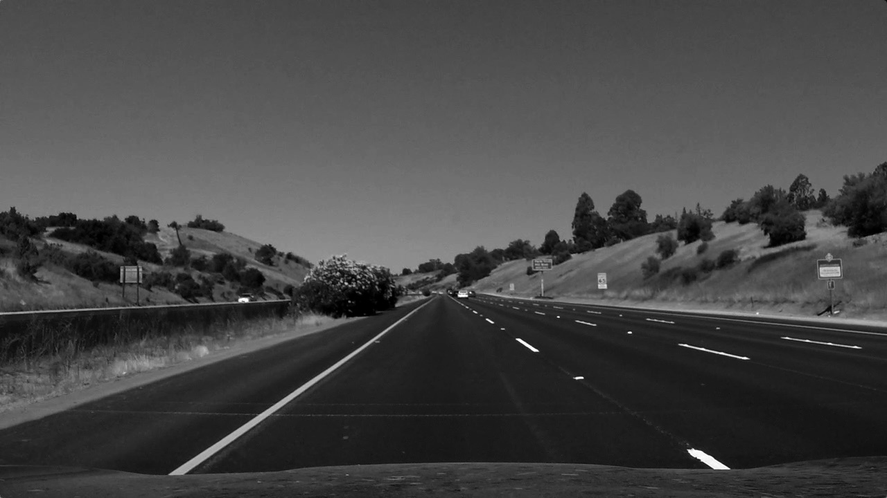

4. Convert original image to HLS color space.
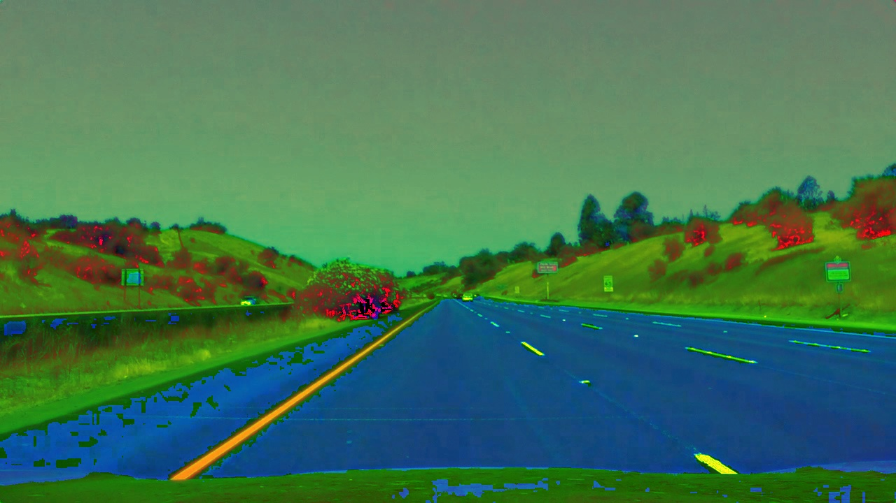

5. Isolate white from HLS to get white mask.
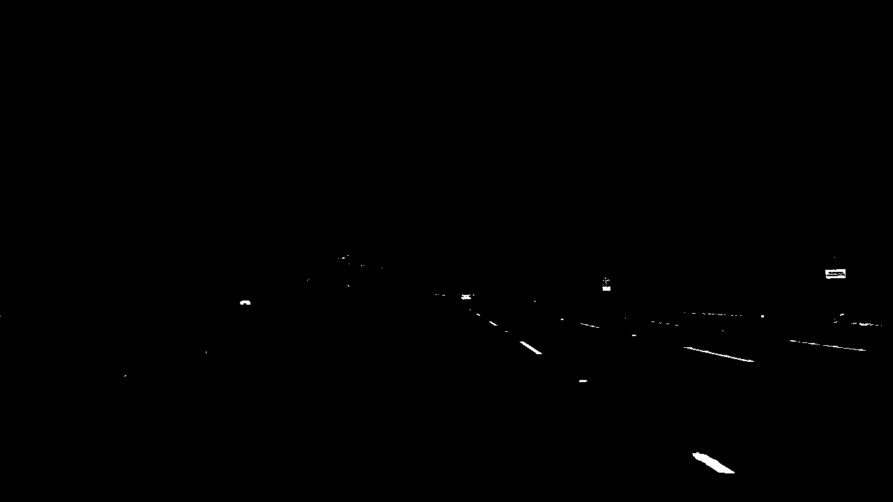

6. Isolate yellow from HLS to get yellow mask.
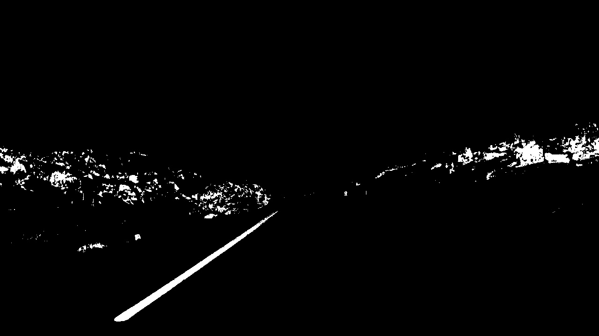

7. Combine white mask and yellow mask.

8. Apply Gaussian Blur.
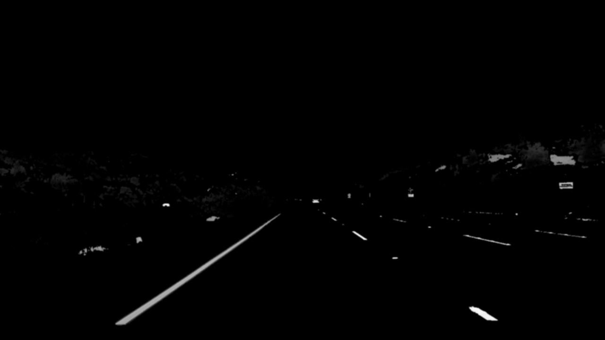

9. Get edges with Canny Edge Detector.
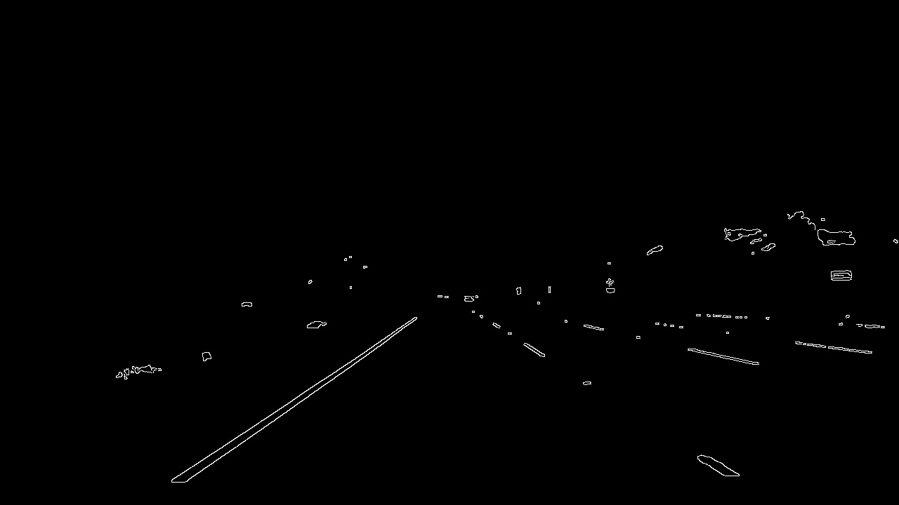

10. Segment region of interest.
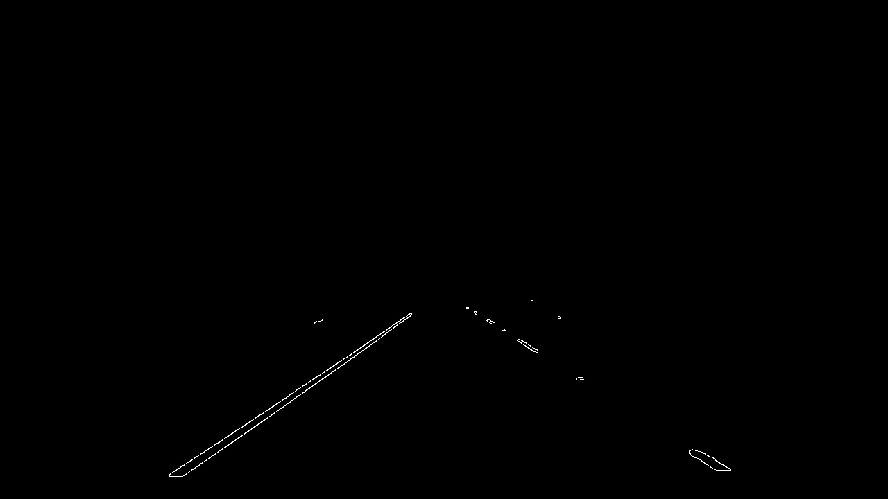

11. Retrieve Hough lines with cv2.HoughLinesP.
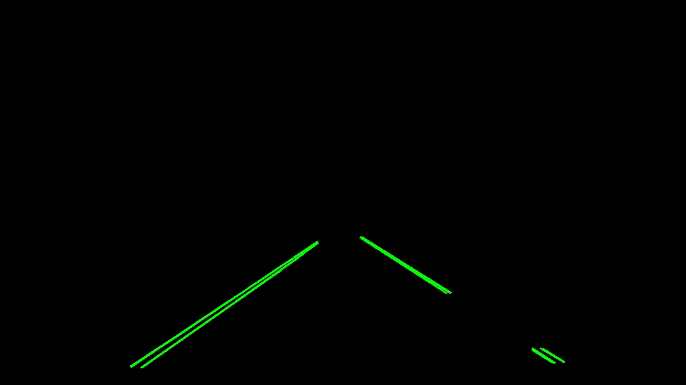

12. Calculate left and right lane from Hough lines and draw them.
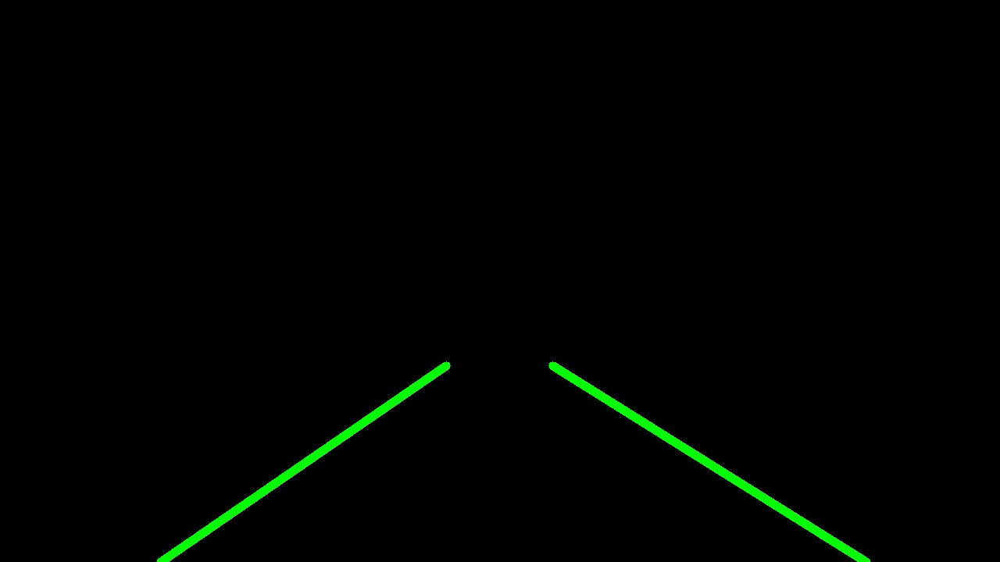

13. Overlay lanes on original image.
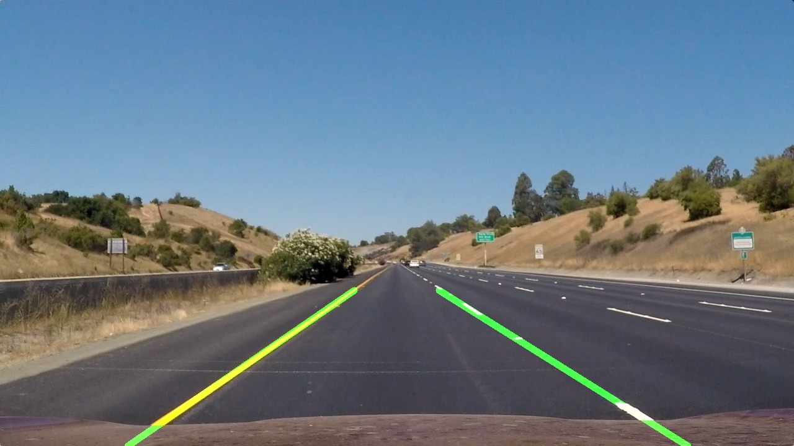

---

## Shortcomings

* Calibration and undistortion are not involved in this project.

* Hough Lines based on straight lines do not work very good for curved lane.
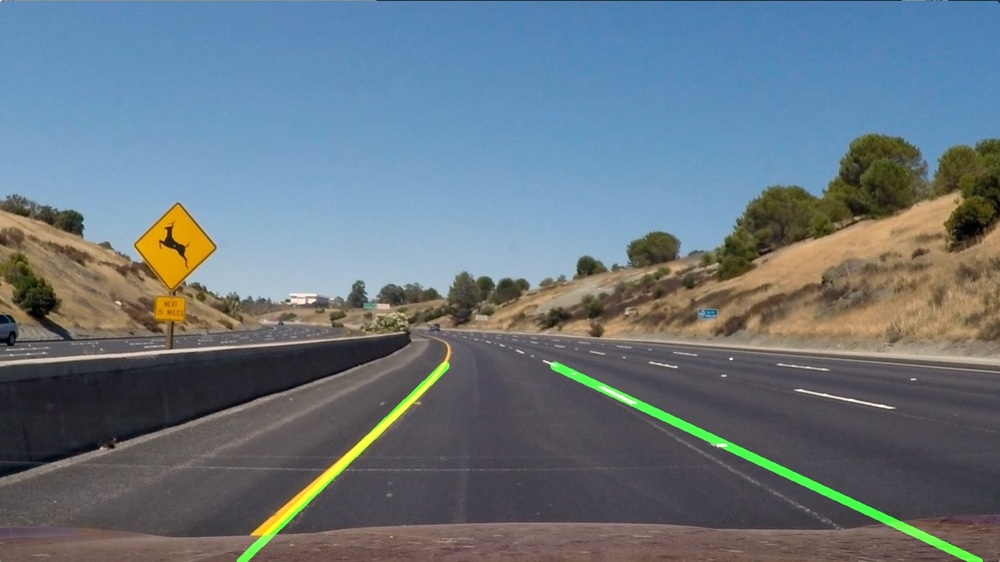

---

## Future improvements

* Instead of Hough Lines, it would be beneficial to use Curve Fitting to detect curved lane.